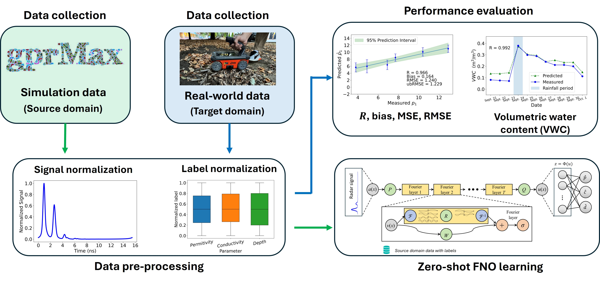

# Zero-Shot GPR-Based Subsurface Sensing with Resolution- and Domain-Invariant Fourier Neural Operators

This repository provides the source code and experimental data associated with the manuscript

**"Zero-Shot GPR-Based Subsurface Sensing with Resolution- and Domain-Invariant Fourier Neural Operators"**

by Zixin Wang, Ishfaq Aziz, and Mohamad Alipour.

The study develops a zero-shot ground-penetrating radar (GPR)-based subsurface sensing framework using Fourier neural operators (FNOs). The proposed FNO is trained exclusively on synthetic GPR data generated through finite-difference time-domain (FDTD) simulations and is subsequently evaluated on real-world GPR measurements without using target-domain data during training.

By learning spectral weights in the Fourier domain and emphasizing dominant low-frequency modes associated with physical wave propagation, the FNO provides temporal resolution invariance and robustness to discrepancies between synthetic and real GPR data. The framework is evaluated using laboratory and field experiments involving both one-layer and two-layer subsurface material configurations.

## Framework Overview

The proposed framework consists of four main stages:

1. **Data collection:** Synthetic GPR signals are generated using FDTD simulations implemented in gprMax, while real-world GPR measurements are collected from laboratory and field experiments.

2. **Data preprocessing:** The amplitude envelope of each GPR A-scan is obtained using the Hilbert transform and normalized to the range [0, 1]. Material-property labels are independently normalized using min–max normalization.

3. **Zero-shot FNO learning:** The FNO is trained exclusively on synthetic GPR data to estimate subsurface material properties, including relative permittivity, electrical conductivity, and layer depth.

4. **Performance evaluation:** The trained FNO is directly evaluated on real-world GPR measurements. Performance is assessed using the Pearson correlation coefficient (R), bias, root mean squared error (RMSE), and unbiased root mean squared error (ubRMSE). The framework is also evaluated in terms of resolution invariance, robustness to domain discrepancies, and computational efficiency.

For the field experiments, soil moisture variation is additionally evaluated in terms of volumetric water content (VWC).

## Experimental Configurations

The study considers four representative experimental scenarios:

- **Laboratory one-layer material:** A single soil layer with varying moisture conditions. Relative permittivity, electrical conductivity, and layer depth are estimated.

- **Laboratory two-layer material:** A layer of wood shavings placed over soil. Material properties of both the soil and wood-shavings layers are investigated.

- **Field one-layer material:** Bare soil monitored under natural environmental and rainfall-induced variations.

- **Field two-layer material:** Soil covered by an upper layer of either natural leaves or wood chips. Soil moisture variations are estimated under realistic field conditions.

Real-world GPR measurements are collected using a GSSI StructureScan MiniXT system equipped with a 2,700 MHz antenna. Synthetic source-domain data are generated using gprMax.

## Repository Contents

The repository is organized according to the experimental configurations investigated in the study:

- `Laboratory_One_Layer_Material/`
  - `Data/` — Synthetic data-generation code and experimental GPR data for the laboratory one-layer configuration.
  - `Model/` — Model training and evaluation notebooks.

- `Laboratory_Two_Layer_Material/`
  - `Data/` — Synthetic data-generation code and experimental GPR data for the laboratory two-layer configuration.
  - `Model/` — Model training and evaluation notebooks.

- `Field_One_Layer_Material/`
  - `Data/` — Synthetic data-generation code and experimental field GPR data for the one-layer configuration.
  - `Model/` — Model training and evaluation notebooks.

- `Field_Two_Layer_Material/`
  - `Data/` — Synthetic data-generation code and experimental field GPR data for the two-layer configurations.
  - `Model/Soil_Leaves/` — Model notebooks for the soil–leaves configuration.
  - `Model/Soil_Wood_Chips/` — Model notebooks for the soil–wood chips configuration.

- `FNO_Code/` — Source code for the Fourier Neural Operator architecture and associated modules.

- `Framework_Overview.jpg` — Overview of the proposed zero-shot FNO framework.

## Models

The repository provides implementations of the data-driven approaches investigated in the study:

- **1D CNN:** One-dimensional convolutional neural network used as a supervised baseline. The model is trained using labeled synthetic data and evaluated on experimental measurements.

- **DANN:** Domain adversarial neural network used as an unsupervised domain-adaptation baseline. DANN uses labeled synthetic source-domain data together with unlabeled real target-domain data to learn domain-invariant representations.

- **MiTSformer:** Transformer-based time-series regression baseline. MiTSformer is trained exclusively on synthetic GPR data and evaluated on experimental measurements under the same zero-shot setting used for the FNO.

- **FNO:** The proposed Fourier Neural Operator model. FNO is trained exclusively on synthetic GPR data and directly applied to real-world measurements without using real-world data during training. Spectral convolution and Fourier-mode truncation enable the model to capture global wave interactions while promoting resolution- and domain-invariant generalization.

## Synthetic Data Generation

Synthetic GPR signals are generated using the finite-difference time-domain (FDTD) method implemented in **gprMax**, which numerically solves Maxwell's equations for electromagnetic wave propagation.

The simulations specify both intrinsic radar parameters and extrinsic material parameters. The material parameters varied for dataset generation include relative permittivity, electrical conductivity, and layer depth.

Synthetic datasets are generated separately for the laboratory and field configurations and are used as the source-domain data for model training.

## Experimental Data

Experimental GPR measurements are collected for four configurations:

- Laboratory one-layer soil
- Laboratory two-layer soil–wood shavings
- Field one-layer bare soil
- Field two-layer soil–leaves and soil–wood chips

The experimental measurements serve as the real-world target domain for evaluating the generalization capability of models trained on synthetic data.

For the field experiments, reference soil properties are measured using an in situ TEROS-12 capacitance sensor. Soil moisture is additionally characterized using volumetric water content (VWC).

## Resolution- and Domain-Invariant Evaluation

In addition to material-property estimation, the study investigates two important generalization capabilities of the proposed FNO:

- **Resolution invariance:** The spectral-convolution formulation allows the FNO to operate across GPR signals with different temporal resolutions without retraining.

- **Domain invariance:** Fourier-mode truncation emphasizes dominant low-frequency spectral information while suppressing high-frequency discrepancies associated with measurement noise, discretization differences, and modeling errors.

The robustness of the FNO to simulation-to-reality discrepancies is further evaluated using synthetic data generated with uncalibrated radar parameters to introduce an increased domain gap.

## Evaluation Metrics

Model performance is evaluated using:

- Pearson correlation coefficient (`R`)
- Bias
- Root mean squared error (`RMSE`)
- Unbiased root mean squared error (`ubRMSE`)
- Standard deviation of predictions
- Training time
- Inference time

## Requirements

The code is implemented in Python. Major dependencies include:

- PyTorch
- NumPy
- pandas
- scikit-learn
- Matplotlib
- SciPy
- gprMax

Additional dependencies may be required by individual notebooks.

## Usage

The notebooks provide the main workflows for:

1. Synthetic GPR data generation
2. GPR signal preprocessing
3. Model training
4. Zero-shot evaluation on experimental GPR measurements
5. Material-property estimation
6. Field soil-moisture and VWC evaluation
7. Resolution- and domain-invariance analyses

Users should update local file paths in the notebooks as needed before execution.

## Citation

If you use the code or data in this repository, please cite:

**Zixin Wang, Ishfaq Aziz, and Mohamad Alipour,  
"Zero-Shot GPR-Based Subsurface Sensing with Resolution- and Domain-Invariant Fourier Neural Operators."**

Full bibliographic information will be added upon publication.